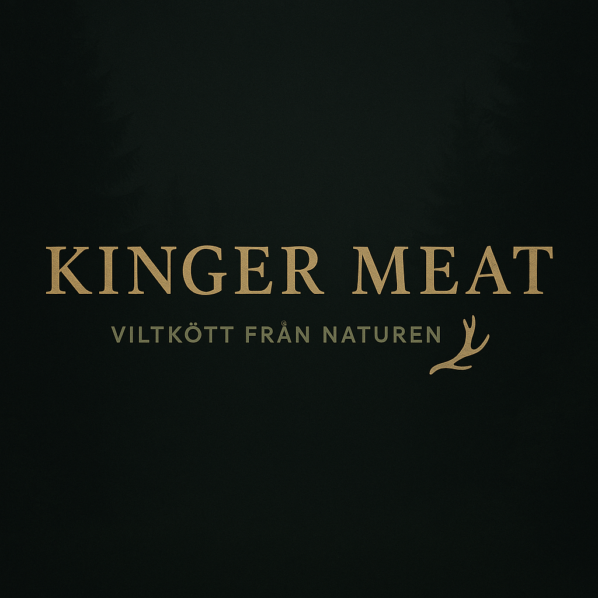
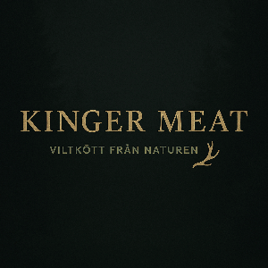

<div align="center">
  

# Kinger Meat


**Premium wild game meat from Sörmland – Powered by a robust Node.js/TypeScript backend.**

[Live Site](https://kingermeat.ttdevs.com) • [API Endpoint](https://api.kingermeat.ttdevs.com) • Technical Report: [English](./docs/TECHNICAL_REPORT_EN.md) / [Swedish](./docs/TECHNICAL_REPORT_SV.md)

</div>

---

## Overview

Kinger Meat is an online shop for wild game meat, built as a final project for the Backend Development course at Yrkeshögskolan i Borås. While the frontend provides a usable shop interface, the project's core strength lies in its **production-ready backend architecture**.


---

## Core Features

### Developer Experience

The custom CLI provides an intuitive interface for managing the server and probing the API directly from your terminal.


### Advanced Observability

The project includes a custom **`kingermeat doctor`** CLI tool that performs exhaustive health checks, verifying environment variables, database latency, and API route integrity in one go.


### Type-Safe Integrity

- **Express 5 + TypeScript**: Modern, strict-type architecture.
- **Zod Validation**: Runtime validation for environment variables and API parameters.
- **Prisma ORM**: Type-safe database queries and automated migrations.

### Performance & Scaling

- **Serverless PostgreSQL**: Hosted on Neon with automated scaling.
- **Graceful Handling**: Integrated `ColdStartLoader` to manage serverless cold starts seamlessly for the user.

---

## Tech Stack

| Layer              | Technologies                                                |
| :----------------- | :---------------------------------------------------------- |
| **Backend**        | Node.js (ESM), Express 5, TypeScript, Prisma, Zod, Helmet   |
| **Frontend**       | React 19, Vite, Tailwind CSS, Framer Motion, React Router 7 |
| **Infrastructure** | PostgreSQL (Neon), Render (IaC via `render.yaml`)           |

---

## Quick Start

```bash
# Clone the repository
git clone git@github.com:tlxq/kingerMeat.git
cd kingerMeat

# Setup Server
cd server && npm install && cp .env.example .env
npx prisma migrate deploy && npx prisma db seed
npm run dev

# Setup Client (in a new terminal)
cd client && npm install && cp .env.example .env
npm run dev
```

---

## Documentation

For a deep dive into the architecture, database modeling, and technical trade-offs, please refer to the full project report in [English](./docs/TECHNICAL_REPORT_EN.md) or [Swedish](./docs/TECHNICAL_REPORT_SV.md).

---

<div align="center">
  
</div>
